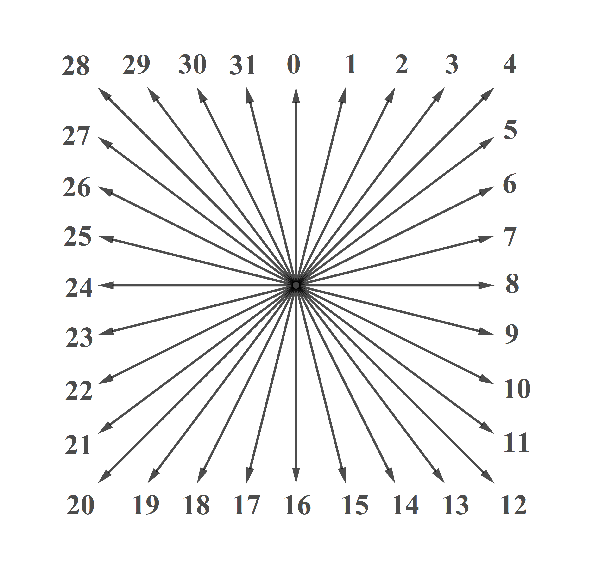

## The code
This code starts from a virgin 501x501 map, all black. From two text files containing the direction of the currents (database_vector.txt) and the force of the currents (database_velocity.txt), I launch particles (choice of the number of particles and their placement). The different images correspond to several trials, one of which is zoomed in.

Here is a visual of the possible directions of the vector: 

