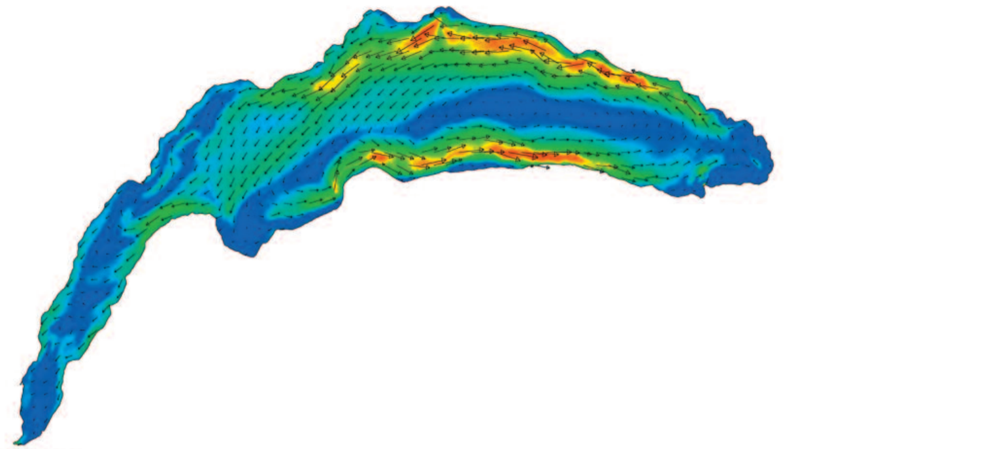

## The code
This code uses the same principles as the previous one (hand-entered vectors and speed) but with several new features. We add a vector to our compass representing a non-existent current and several statistics. The two images (50 and 50000) represent two tests with 50 then 50000 particles and initialMap.png is the image originally used to create the vectors manually.

