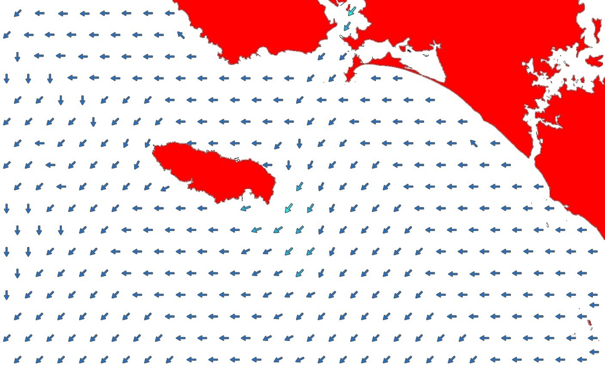
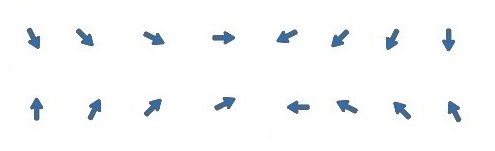
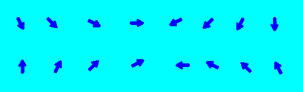
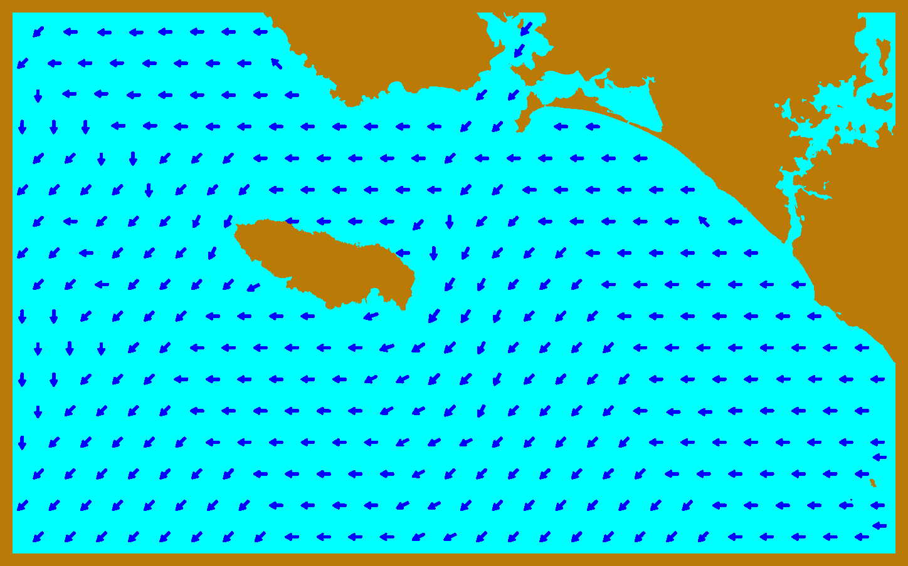
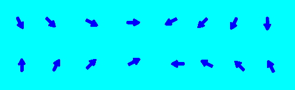
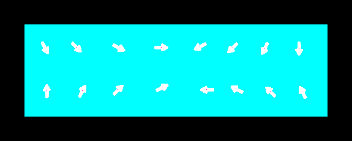
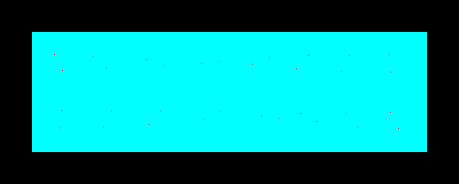
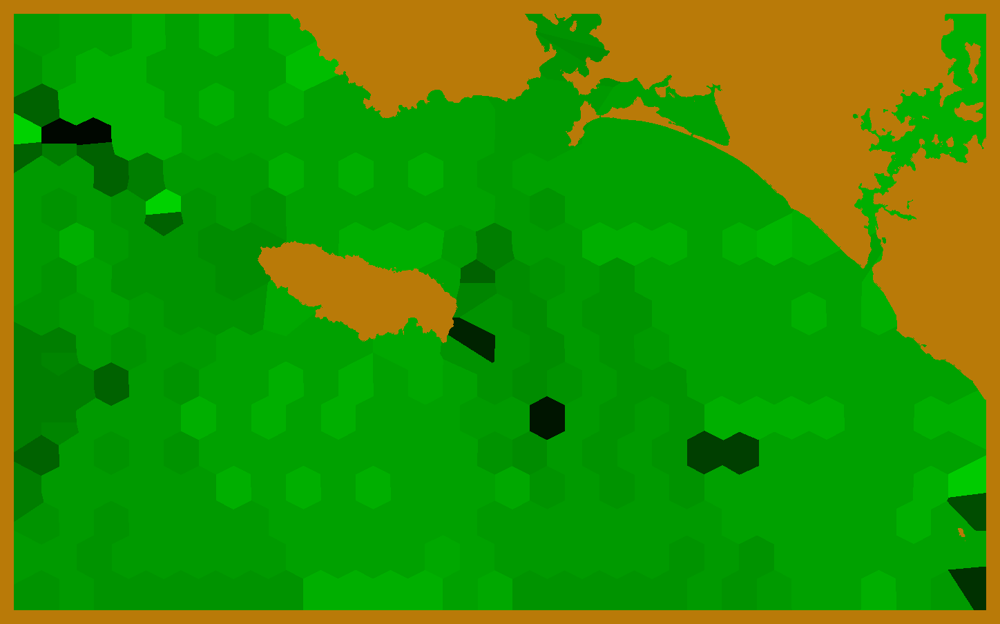
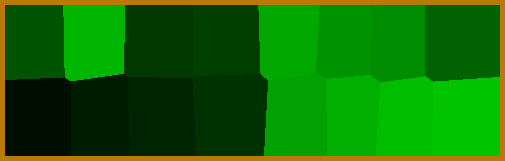

## The code
For this code I chose to separate the process into 3 sub-codes as each one takes a long time to run. The script has several steps which I will explain.

The starting image is as follows:

  

To start I chose to change the images to separate arrows, land and water (navy blue, cyan and brown). 

  

However this treatment is not perfect and elements of each colour slip into the wrong place so I then process the image several times to get the one below:

  

In order to detect the direction of the arrows I try to find the barycentres of the arrows which give us an image with white arrows and a red dot on the barycentre.

  

Finally I look for the largest diagonal passing through each barycentre which gives us its blue arrows with two red dots representing the direction of the vector. The navy blue is then replaced by cyan blue.

  

Finally I look for each point in the water for the closest direction and this gives us a map filled with areas with different directions that we can recognise by the shade of green in it.

  

All that has to be done is to release the particles to obtain our microparticle displacement.

